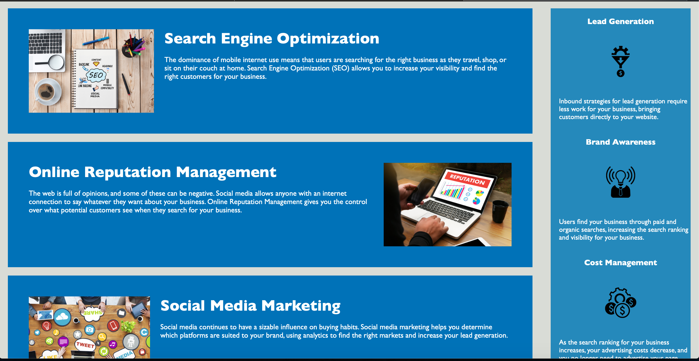

# HoriseonAdvertisingAgency

<strong>Project Summary:</strong>

Online advertisement agency showing agency information

    
   
   

 
 
<strong>Description:</strong>
 
Developed a single webpage for Advertising agency using frontend technologies of HTML & CSS with style, header-footer, multi-column layouts. 
Incorporated images, static links that highlight sections of the same page. Added semantic HTML elements to increase web accessibility.
Applied various element styling using CSS and styling is organized with semantic structure & ability to ensure the webpage is visually pleasing & well laid out.
Added relevant comments in both the html & css files for better readability & understanding of what the code does.
Tested the webpage to ensure correct layout in MacOS, Windows & different browsers such as Chrome, Edge, IE 11 & Safari.
 
 
<strong>Purpose: </strong> 
Webpage shows information of three basic service which Advertising agency provides:
1. Search Engine Optimization
2. Online Reputation Management
3. Social Media Marketing

<strong>Code Installation: </strong>
 
$ cd [path_to_save_codebase]  
$ git clone https://github.com/arti-karnik/HoriseonAdvertisingAgency
Go ahead and make modifications

<strong>Contributing to repo:</strong>
- Fork it https://github.com/arti-karnik/HoriseonAdvertisingAgency
- Create your local branch 
git checkout -b <branchname>
- Add changes and add it to your local branch
- Commit your changes
git commit -m "<commit message>"
- Push to the branch and create a PR
git push 
Create PR for review and merge code.
   
<strong>Github Profile: </strong>
 
https://github.com/arti-karnik

<strong>Application Live URL:</strong>  
https://arti-karnik.github.io/HoriseonAdvertisingAgency/

